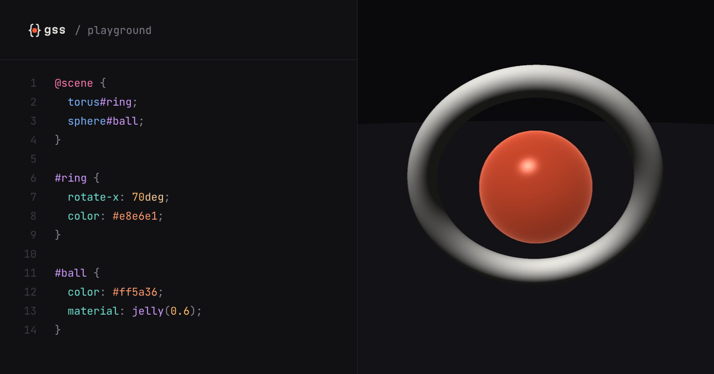

<p align="center">
  <a href="https://gss-lang.dev">
    <picture>
      <source media="(prefers-color-scheme: dark)" srcset="public/marks/lockup-dark.svg" />
      
    </picture>
  </a>
</p>

<p align="center"><strong>Style sheets for the GPU.</strong><br />
Selectors, the cascade and <code>@keyframes</code>, compiled into a single raymarching shader.</p>

<p align="center">
  <a href="https://gss-lang.dev">Website</a> ·
  <a href="https://gss-lang.dev/playground">Playground</a> ·
  <a href="https://gss-lang.dev/docs">Reference</a>
</p>

<p align="center">
  <a href="https://gss-lang.dev/playground"></a>
</p>

---

GSS (GPU Style Sheets) is a 3D language for people who already speak CSS. You declare shapes in a
`@scene`, style them with selectors, and the compiler turns the whole thing into one GLSL
fragment shader: signed distance fields, raymarched in WebGL2. No Three.js, no meshes, no UVs.

```css
@scene {
  torus#ring;
  sphere#ball;
}

#ring {
  translate: 0 1.2 0;
  rotate-x: 70deg;
  radius: 1.1;
  thickness: 0.14;
  color: #e8e6e1;
}

#ball {
  translate: 0 1.2 0;
  radius: 0.55;
  color: #ff5a36;
  material: jelly(0.6);
  animation: float 2s ease-in-out alternate;
}

@keyframes float {
  from { translate: 0 1.2 0; }
  to   { translate: 0 1.5 0; }
}
```

## Why

Front-end developers already know how to describe what things look like. The moment they want to
go 3D, they hit GLSL: distance functions, vectors and math, written in a way that has little to do
with how they think about design. GSS is a way in: a familiar syntax to start creating in 3D today,
and a readable path toward the shader underneath. It is not meant to replace GLSL.

## What it can do

- **Structure**: `@scene { cube.corner * 4; torus#hero; }`, multiplication with auto-numbered ids,
  `group#g { … }` to move several shapes together.
- **Selectors and the cascade**: `shape`, `.class`, `#id`, `*`, lists, the descendant combinator,
  specificity, `!important`, and `::face(front)` / `::top` / `::bottom` to style one face.
- **Shapes**: `cube`, `sphere`, `torus`, `cylinder`, `cone`, `capsule`, `plane`, `path` (a tube
  along an SVG path) and `prism` (a `polygon()` or `path()` contour, extruded).
- **Materials**: `matte()`, `metal()`, `jelly()`, `glass()` with refraction and frost, and the
  shortcuts `gold`, `chrome`, `ice`.
- **Textures**: `texture: url("dirt.png")` projected on each face, a different image per face
  (the Minecraft grass block), `image-rendering: pixelated` and `texture-size` to repeat it.
- **Motion**: `@keyframes` and `animation`, computed on the GPU.
- **Math**: `calc()`, `min()`, `max()`, `clamp()`, trigonometry, and `sibling-index()` /
  `sibling-count()` for CSS-style loops.
- **Variables**: `--size: 2` and `var(--size, 1)`, inherited from the scene to groups to objects,
  and animatable in `@keyframes`.
- **Colors**: hex, `rgb()`, `hsl()` and the CSS named colors (`tomato`), with math and `var()`
  inside: `hsl(calc(sibling-index() * 45) 90% 60%)`.
- **The scene**: `floor`, `background`, `light`, `ambient` and an orbit camera.

Every property, shape and selector is described once in the registry
(`src/compiler/registry.ts`), and the [reference](https://gss-lang.dev/docs) is generated from it,
with a live example for each entry.

## How it works

```
GSS text → tokenizer → parser → scene expansion → cascade → validation → GLSL codegen → WebGL2
```

Everything that can be decided at compile time is: the cascade, the selectors, the units,
`var()`, the math and the colors, in that order. The shader receives final values. The runtime only holds what changes every frame (time,
camera) and sends it as uniforms.

The design decisions, and why they were made, are recorded in [`DECISIONS.md`](DECISIONS.md).

## Tools

- **Playground**: [gss-lang.dev/playground](https://gss-lang.dev/playground). Located errors,
  examples, the generated GLSL, share by URL, export to Shadertoy.
- **Editor extension** for VS Code and Cursor: syntax highlighting, formatting and the `.gss` file
  icon (`editors/vscode`).
- **Formatter**: `npm run format` (or `Shift+Alt+F` in the playground).

## Develop

```sh
npm install
npm run dev      # the site: home, playground, docs, brand
npm test         # Vitest
npm run build    # type-check, then build to dist/
```

| Path | What lives there |
| --- | --- |
| `src/compiler/` | tokenizer, parser, cascade, validation, variables, math, colors, GLSL codegen, the registry |
| `src/runtime/` | WebGL2 renderer, camera, editor, share links |
| `src/docs/` | the generated reference and the syntax highlighter |
| `src/playground/`, `src/home/` | the playground and the home page |
| `editors/vscode/` | the VS Code / Cursor extension |
| `DESIGN.md` | the visual identity ("Distance field") |

## Status

Early and moving fast. The package is not on npm yet. The syntax may still change; each change is
logged in `DECISIONS.md`.

## Brand

The mark, the wordmark, the icon and the social cards are on
[gss-lang.dev/brand](https://gss-lang.dev/brand).
